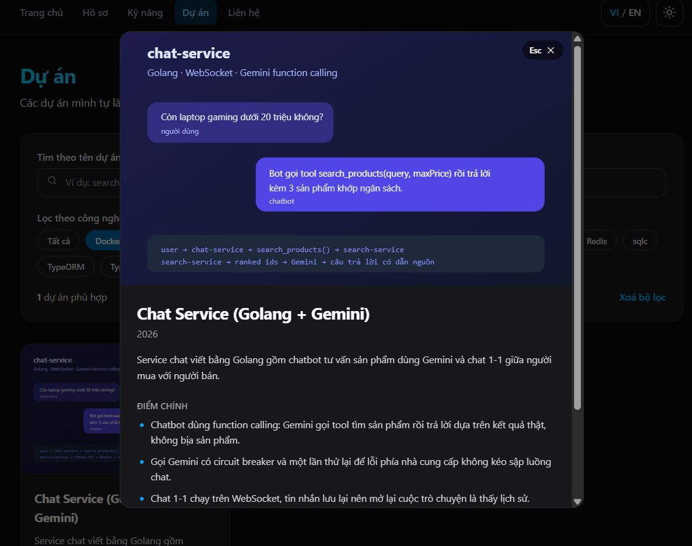

[Tiếng Việt](README.md) · **English**

# Personal CV Website - Chau Gia Khang

A CV as a single page application: 5 pages, Vietnamese/English content, dark mode and two page transitions.

**Demo:** <https://chau-gia-khang-portfolio.vercel.app>

## Screens



## Tech stack

| Layer | Choice |
| --- | --- |
| Build tool | Vite 8 |
| UI | React 19 + TypeScript |
| CSS | Tailwind CSS 4 |
| Routing | React Router 7 |
| Animation | Framer Motion 13 |
| Lint | oxlint |

## Running the project

```bash
npm install
npm run dev
```

Open http://localhost:5173

Other commands:

```bash
npm run build     # tsc -b + vite build, output in dist/
npm run preview   # preview the production build
npm run lint      # oxlint
```

## Features

- **6 routes** with React Router 7: `/`, `/resume`, `/skills`, `/projects`, `/contact` and a 404 page for unknown paths. The navbar marks the active route and every navigation scrolls back to the top.
- **Two page transitions**: fade with a vertical slide (`PageTransition`) and a gradient progress bar sweeping across the top edge (`RouteProgress`). Both run for navbar links and CTA buttons alike.
- **Bilingual VI/EN**: every visible string is typed as `Localized<T> = { vi: T; en: T }`, switched from the navbar, remembered in `localStorage`, and reflected in the `lang` attribute of `<html>`.
- **Dark mode**: follows the operating system on first visit, then remembers the user's choice; switching runs a 300ms colour transition and updates `color-scheme` so the scrollbar follows.
- **Data-driven projects page**: data lives in `src/data/projects.ts`, rendered with `.map()`, searchable by name and filterable by several technologies at once (AND logic). Projects that are not deployed show a disabled demo button with their own note.
- **Project detail dialog** built on the native `<dialog>` element: focus is trapped inside, `Escape` or a backdrop click closes it, and focus returns to the button that opened it.
- **Contact form**: all four fields required, email format checked, message at least 20 characters; per-field errors, disabled button with a spinner while submitting, then a success message (no backend yet, so the request is mocked with `setTimeout`).
- **Hero banner**: cyan-indigo-purple gradient, a seamless looping SVG wave, and an intro sentence typed out over 10 seconds, held for 5 seconds, erased and repeated; the speed is derived from the sentence length so the Vietnamese and English versions finish together.
- **Other interactions**: mobile hamburger menu, back-to-top button, experience/education tabs, scroll reveal, and skill proficiency bars.
- **Responsive**: mobile below 768px, tablet 768-1024px, desktop above 1024px.
- **Accessibility**: semantic HTML, one `<h1>` per page, descriptive `alt` text, `<label htmlFor>` and `aria-describedby` on form errors, arrow-key tab navigation following WAI-ARIA, a skip-to-content link, and `prefers-reduced-motion` support.
- **Performance**: images compressed to 40-100 KB, `loading="lazy"` on thumbnails, and hand-written inline SVG icons instead of an icon library.

## Project structure

```
src/
├── assets/            avatar and project thumbnails
├── components/        reusable components (Header, Footer, ProjectCard, ProjectDialog, Tabs, TypingText, WaveDivider...)
├── context/           ThemeProvider (dark mode) and LanguageProvider (VI/EN)
├── data/              CV content: profile, skills, projects, nav
├── hooks/             useLanguage, useTheme, useContactForm, useScrollTrigger
├── i18n/              ui.ts - every interface string in both languages
├── pages/             Home, Resume, Skills, Projects, Contact, NotFound
├── types.ts           shared types, including Localized<T>
├── App.tsx            route declarations + AnimatePresence
└── main.tsx           entry point wrapping the providers
```

CV content is kept out of the components: editing `src/data/*` changes the content without touching any component.

## Deployment

The build output is a static site and works on Vercel, Netlify or GitHub Pages.

```bash
npm run build   # output in dist/
```

Being a SPA, the host has to rewrite unknown paths to `index.html` so a refresh on a nested route does not 404. The repo ships `vercel.json` for Vercel and `public/_redirects` for Netlify.
