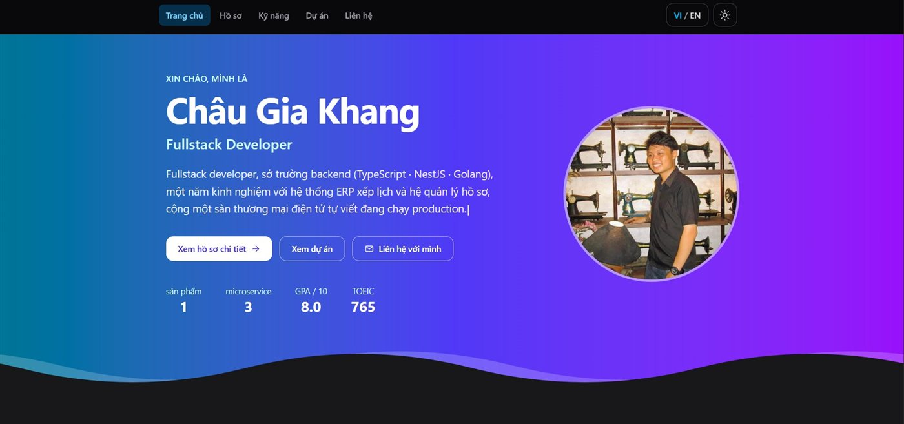
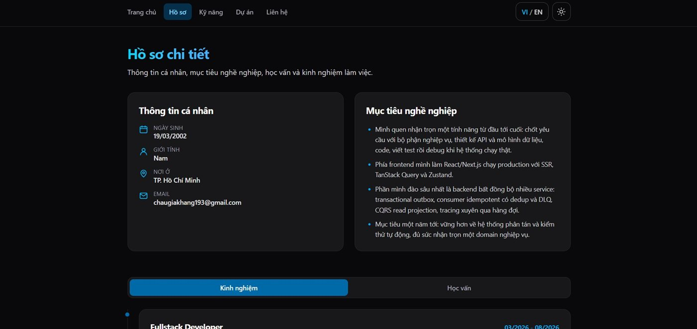
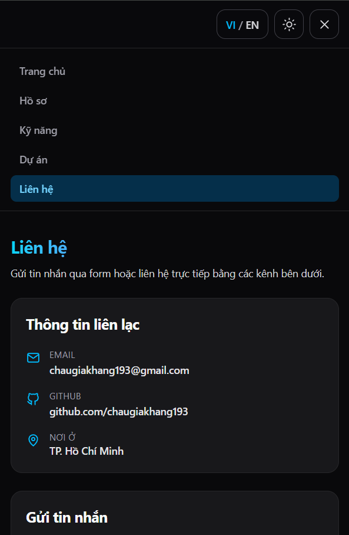

**Tiếng Việt** · [English](README.en.md)

# Website CV cá nhân - Châu Gia Khang

CV dạng website (single page application) với 5 trang, song ngữ Việt/Anh, dark mode và hai hiệu ứng chuyển trang.

**Demo:** <https://chau-gia-khang-portfolio.vercel.app>

## Giao diện

| Trang chủ | Hồ sơ chi tiết |
| --- | --- |
|  |  |
| **Chi tiết dự án trong hộp thoại** | **Menu điều hướng ở khổ mobile** |
|  |  |

## Công nghệ

| Thành phần | Lựa chọn |
| --- | --- |
| Build tool | Vite 8 |
| UI | React 19 + TypeScript |
| CSS | Tailwind CSS 4 |
| Routing | React Router 7 |
| Animation | Framer Motion 13 |
| Lint | oxlint |

## Chạy dự án

```bash
npm install
npm run dev
```

Mở http://localhost:5173

Các lệnh khác:

```bash
npm run build     # tsc -b + vite build, xuất ra dist/
npm run preview   # xem thử bản build
npm run lint      # oxlint
```

## Tính năng đã làm

- **6 route** với React Router 7: `/`, `/resume`, `/skills`, `/projects`, `/contact` và trang 404 cho đường dẫn không tồn tại. Navbar có active state theo route, đổi trang là tự cuộn về đầu.
- **Hai hiệu ứng chuyển trang**: fade + trượt dọc (`PageTransition`) và thanh progress gradient chạy ngang mép trên (`RouteProgress`). Cả hai chạy khi bấm navbar lẫn nút CTA.
- **Song ngữ VI/EN**: mọi chuỗi hiển thị có kiểu `Localized<T> = { vi: T; en: T }`, đổi bằng nút trên navbar, nhớ trong `localStorage`, cập nhật luôn thuộc tính `lang` của `<html>`.
- **Dark mode**: lần đầu vào lấy theo cài đặt hệ điều hành, sau đó nhớ lựa chọn; lúc đổi có transition màu 300ms và đổi `color-scheme` để thanh cuộn theo cùng.
- **Trang Dự án data-driven**: dữ liệu trong `src/data/projects.ts`, render bằng `.map()`, tìm theo tên kết hợp lọc nhiều công nghệ cùng lúc (điều kiện AND). Dự án chưa deploy thì nút demo bị khoá kèm ghi chú riêng.
- **Hộp thoại chi tiết dự án** dùng thẻ `<dialog>` gốc: khoá focus bên trong, đóng bằng `Escape` hoặc bấm ra nền, trả focus về đúng nút vừa bấm.
- **Form liên hệ**: bắt buộc 4 trường, kiểm tra định dạng email, nội dung tối thiểu 20 ký tự; hiện lỗi theo từng trường, disable nút và hiện spinner khi gửi, báo thành công sau đó (chưa có backend nên giả lập bằng `setTimeout`).
- **Hero banner**: nền gradient cyan-indigo-tím, viền sóng SVG chạy vòng lặp liền mạch, câu giới thiệu gõ từng ký tự trong 10 giây rồi dừng 5 giây, xoá và lặp lại; tốc độ tính theo độ dài câu nên bản Việt và Anh gõ xong cùng lúc.
- **Tương tác khác**: menu hamburger cho mobile, nút back-to-top, tab Kinh nghiệm/Học vấn, hiệu ứng hiện dần khi cuộn tới, thanh mức độ thành thạo kỹ năng.
- **Responsive**: mobile < 768px, tablet 768-1024px, desktop > 1024px.
- **Accessibility**: HTML semantic, mỗi trang một `<h1>`, ảnh có `alt` mô tả thật, form có `<label htmlFor>` và `aria-describedby` cho lỗi, tab chuyển bằng phím mũi tên theo chuẩn WAI-ARIA, link "bỏ qua tới nội dung chính", tôn trọng `prefers-reduced-motion`.
- **Tối ưu**: ảnh nén còn 40-100 KB, `loading="lazy"` cho thumbnail, icon viết tay bằng SVG inline thay vì kéo thêm thư viện.

## Cấu trúc thư mục

```
src/
├── assets/            ảnh avatar và thumbnail dự án
├── components/        component dùng lại (Header, Footer, ProjectCard, ProjectDialog, Tabs, TypingText, WaveDivider...)
├── context/           ThemeProvider (dark mode) và LanguageProvider (VI/EN)
├── data/              nội dung CV: profile, skills, projects, nav
├── hooks/             useLanguage, useTheme, useContactForm, useScrollTrigger
├── i18n/              ui.ts - toàn bộ chuỗi giao diện song ngữ
├── pages/             Home, Resume, Skills, Projects, Contact, NotFound
├── types.ts           kiểu dùng chung, gồm Localized<T>
├── App.tsx            khai báo route + AnimatePresence
└── main.tsx           entry point, bọc các Provider
```

Nội dung CV tách hẳn khỏi giao diện: sửa `src/data/*` là đổi được nội dung mà không đụng tới component.

## Deploy

Bản build là static site, deploy được lên Vercel, Netlify hay GitHub Pages.

```bash
npm run build   # kết quả nằm trong dist/
```

Vì đây là SPA, host cần rewrite mọi đường dẫn về `index.html` để F5 giữa chừng không bị 404. Repo có sẵn `vercel.json` cho Vercel và `public/_redirects` cho Netlify.
